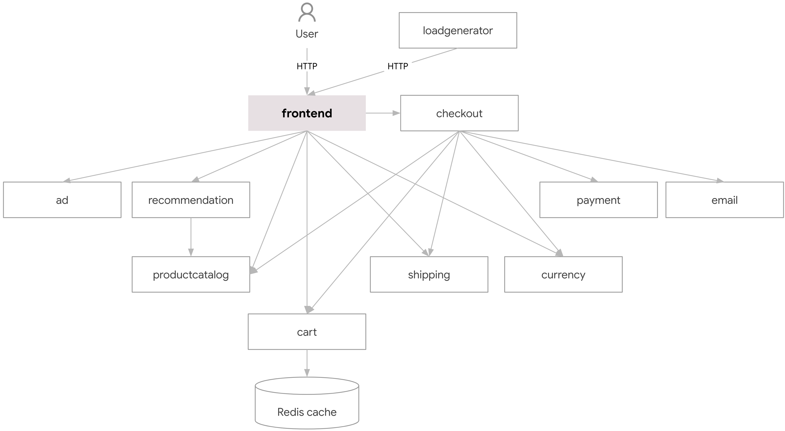

# Projeto de Microsserviços

## Descrição da Aplicação
A aplicação **Boutique Online** possui no total 11 microsserviços e são escritos em linguagens de programação diferentes, os serviços se comunicam através do gRPC. [Documentação gRPC](https://grpc.io/) para mais informações.

## Diagrama


## Referência serviço, linguagem e descrição.
| Serviço        | Linguagem | Descrição |
| -------------- | --------- | --------- |
| frontend       | Go        | Expõe um servidor HTTP, não precisa de autenticação no login. |
| cart           | C#        | Armazena os produtos no carinho de comprar no Redis. |
| productcatalog | Go        | Fornece a lista de produtos em JSON, procura produtos e obtem produtos individuais. |
| currency       | Node.js   | Faz conversão entre em moedas, usa valores reais obtidos do Banco Central Europeu. |
| payment        | Node.js   | Simula a cobrança no cartão de crédito com o valor fornecido e retorna um ID de transação. |
| shipping       | Go        | Simula estimativa de custo de envio com base no carrinho de compras. |
| email          | Python    | Simula o envio de e-mail para o usuário. |
| checkout       | Go        | Recupera o carrinho do usuário, prepara o pedido, pagamento, envio e a notificação por e-mail. |
| recommendation | Python    | Recomenda outros produtos baseado no carrinho. |
| ads            | Java      | Disponibiliza anúncios de texto baseado em determinadas palavras de contexto. |
| loadgenerator  | Python    | Envia solicitações que imitam fluxos de compras realistas do usuário para o frontend. |

# Como usar?
1. **Clonar o repositório.**
```
git clone https://github.com/leofranzen/ecommerce-microservices-operation
cd ecommerce-microservices-operation/
```

2. **Levantar os serviços.**
- [Docker Compose](https://docs.docker.com/compose/):
```
docker-compose up -d
```

- [Kubernetes](https://kubernetes.io):
```
kubectl apply -f k8s/ -R
```

3. **Acesse a aplicação pelo navegador.**
```
http://localhost:8080
```

## Aplicação no ar
| Página inicial | Página do Carinho |
| -------------- | ----------------- |
|  |  |

## Créditos
Créditos da aplicação vão para [Google Cloud Platform](https://github.com/GoogleCloudPlatform/microservices-demo).

